# Lab-13: Explore sensitivity labels in Microsoft Purview

## Lab scenario
In this lab, you will explore the capabilities of sensitivity labels.  You will go through the settings for existing sensitivity labels that have been created and the corresponding policy to publish the label.   Then you will see how to apply a label and the impact of that label, from the perspective of a user.

## Lab objectives

In this lab, you will complete the following tasks:

+ Task 1: Explore the capabilities of sensitivity labels
+ Task 2: How to apply a label
+ Task 3: Impact of that label

## Estimated timing: 60 minutes

## Architecture diagram

## Task 1: Explore the capabilities of sensitivity labels
In this task you will gain an understanding of what sensitivity labels can do by going through the settings for an existing sensitivity label that have been created and the corresponding policy to publish the label.

1. Open Microsoft Edge. In the address bar enter https://admin.microsoft.com. 
   
1. In the Sign-in window, enter the following **email/username** and click on **Next**.

    * Email/Username: <inject key="AzureAdUserEmail"></inject>

1. Now enter the password and click on **Sign in**.
   
   * Password: <inject key="AzureAdUserPassword"></inject>
  
1. When prompted to stay signed-in, select **Yes**. This takes you to the Microsoft 365 admin center page.

1. From the left navigation pane of the Microsoft 365 admin center, select **Show all**.

    

1. Under **Admin centers (1)**, select **Compliance (2)**.

    

1. Sometimes, A new browser page opens.Since you are already signed in, your email will be listed. You can select your email address, to log in to Microsoft Purview.
    
    

1. Upon logging in to the portal, a pop-up window will appear. Choose **Go to classic portal** in the pop-up.

    
   
1. Now, click on **Switch** next to the **Microsoft 365 compliance portal** option to return to the classic portal.

    

1. You are now located on the homepage of the classic Microsoft Purview portal.

    

1. Navigate to **Audit (1)** under **Solution** from the left Navigation pane. If auditing isn't turned on, a banner is displayed prompting you *Start recording user and admin activity*. Select the **Start recording user and admin activity (2)** banner. It has to be turned on to create  **auto-label policy** in further tasks.

    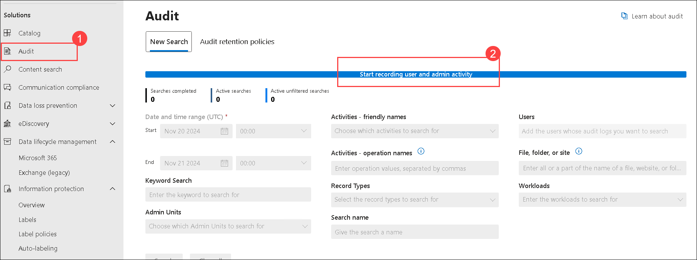   

    >**Note:** It may take up to 60 minutes for the change to take effect.

1. In the left navigation panel of Microsoft Purview, go to **Solutions (1)**, select **Information Protection (2)**, and then choose **Overview (3)**. On the overview page, click **Turn on now (4)** inside the yellow information box to enable processing of encrypted sensitivity labels in Office online files stored in OneDrive and SharePoint.

   > **Note**: There can be a delay for the setting to propagate through the system. Refresh the Page once.

    

1. Now select **Labels (1)** from the left navigation panel and then select **Create a label (2)**.

    

1. On the new label configuration page, enter the details provided below and click **Next (4)**.

    | Setting | Values |
    | -- | -- |
    | **Name** | **Confidential-Finance (1)** |
    | **Display name** | **Confidential-Finance (2)** |
    | **Description for users** | **Confidential-Finance Demo (3)** | 

    

1. On the **Define the scope for this label** page, read the description but **do not** change any settings. Select **Next** at the bottom of the page.

      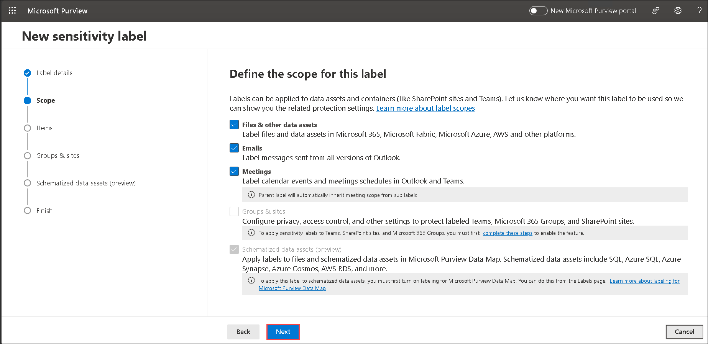

1. On the Choose protection settings for labeled items page, select **Control access (1)** and **Apply content marking (2)** options and then click **Next (3)**.

    

1. Under **Access Control (1)** section, scroll down and click on **Assign Permissions**.

    
    
1. Click on **+Add Users or Groups** in the **Assign Permissions** page that shows up. 

    

1. Select your username **odl_user_<inject key="deploymentID"></inject> (2)** and **Megan Bowen (1)** and click on **Add (3)**.

    

1. On the Assign permissions page, check the users you selected in the previous step. These users can interact with the content that has this label applied. Then, click **Save**.

    

1. Under Users and groups, the tenant is defined, allowing all users in your tenant to view content with this label. The finance team is also listed and has co-author permissions. Do not change any settings. Select **Next** on the bottom of the page.

    

1. On the content markings page, take note of the information box on the top of the page. **Turn on (1)** the Content Making and select **Add a watermark (2)**, **Add a header (3)**, & **Add a footer (4)**. Click on **Customize text (5),(6),(7)** on each and provide the text **customize watermark test** and click on **Save**.  Content markings will be applied to the documents but only headers and footers will be applied to email messages. In other words, watermarks are not applied to emails. The content marking associated with this label is a watermark. Select **Next (8)** on the bottom of the page.

    

    

1. You are now in the Auto-labeling for files and emails window. Turn on the **Auto-labeling for files and emails (1)** and read the description of auto-labeling on the top of the page and the information box below it. Select **Next (2)** on the bottom of the page.

    

1. This next window defines protection settings for groups, and sites that have this label applied. This is not enabled, select **Next** on the bottom of the page.

    

1. This next window is a preview feature to automatically apply this label to Azure database columns (such as SQL, Synapse, and more) that contain the sensitive info types you choose. This features is not enabled. Select **Next** on the bottom of the page.

      
       
      
1.  Review the settings and click on **Create label**.

      
      
1. Click on **Done** on next window.   

      

1. A new window of **Publish label** will open. Click on **Create new nabel policy**.

      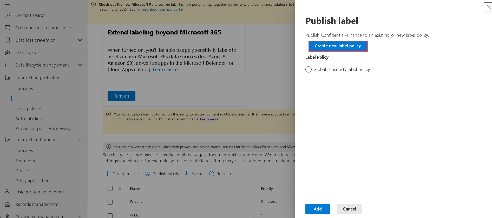

1. A new window of Create policy will open. Select **Choose sensitivity labels to publish (1)**. A window opens that provides information about the policy. This policy serves to publish the IT-Department-Demo. Select **Confidential-Finance (2)** from label and select **Add (3)** on the bottom of the page. And then click on **Next (4)**.

     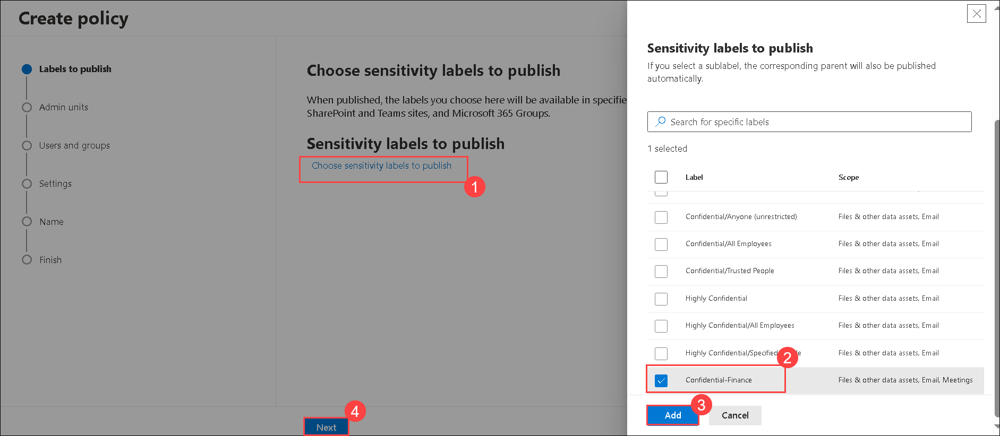
     
1. Under the Sensitivity labels to publish.  Don’t change any settings.  Select **Next** on the bottom of the page.

     
     
1. Click on **Next** on Assign Admin Units(Preview). 

        

1. Read the description under **Publish to users and groups**.  Notice this label is available to all users.  Don’t change any settings.  Select **Next** on the bottom of the page.

    

1. Under the policy settings.  Don’t change any settings.  Select **Next** on the bottom of the page.

    

1. Under the **Apply a Default label to documents**.  Don’t change any settings.  Select **Next** on the bottom of the page.

    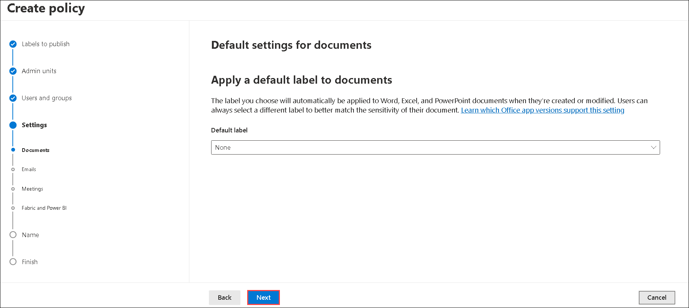

1. Under the **Apply a Default label to emails**.  Don’t change any settings.  Select **Next** on the bottom of the page.

    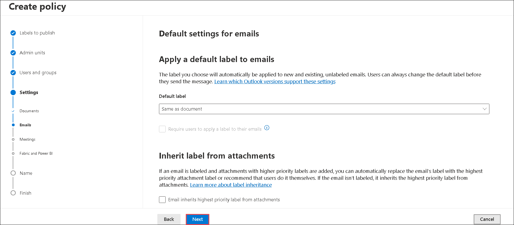
    
1. Under the **Apply a default label to meetings and calendar events**.  Don’t change any settings.  Select **Next** on the bottom of the page.    

    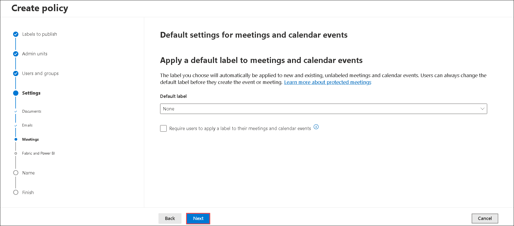
    
1. Under the **Apply a default label to Fabric and Power BI content**.  Don’t change any settings.  Select **Next** on the bottom of the page.

    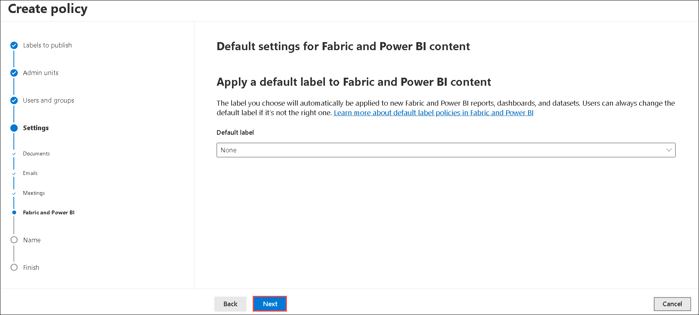
    
1. The last configuration option is to name your policy. Enter the policy name as **Confidential-Finance Policy (1)**.  Select **Next (2)** on the bottom of the page to exit the policy configuration and return to the Information protection page.

    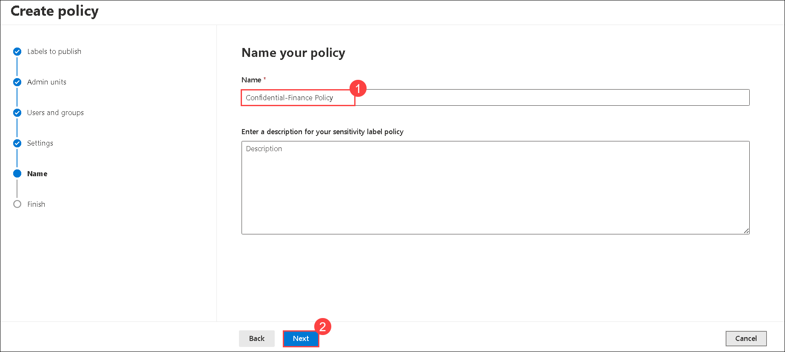
    
1. Review the settings and click on **Submit** and then select **Done**.

    
    
    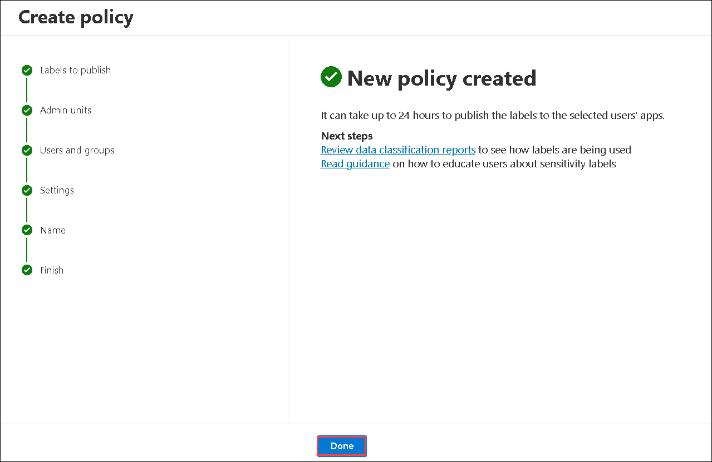    
    
    >**Note**- The label created cannot be deleted, it can only be edited. 

1. From the left navigation panel, select Home to return to the Microsoft Purview.

       

1. Keep this page open, you will use it in the next task.

1. It can take up to 24 hours to publish the labels to the selected users apps

1. From the left navigation panel, under **Information protection**, select **Auto-labeling**. Then click on select **+Create auto-label policy (3)**.

      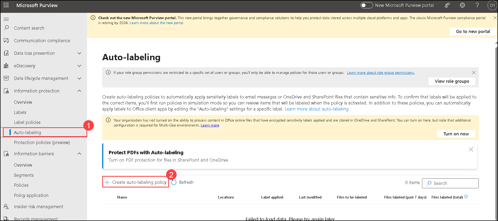

1. Note the available options. Select **Medical and health (1)** then select one of the available templates **(2)**. Select **Next (3)**.  

      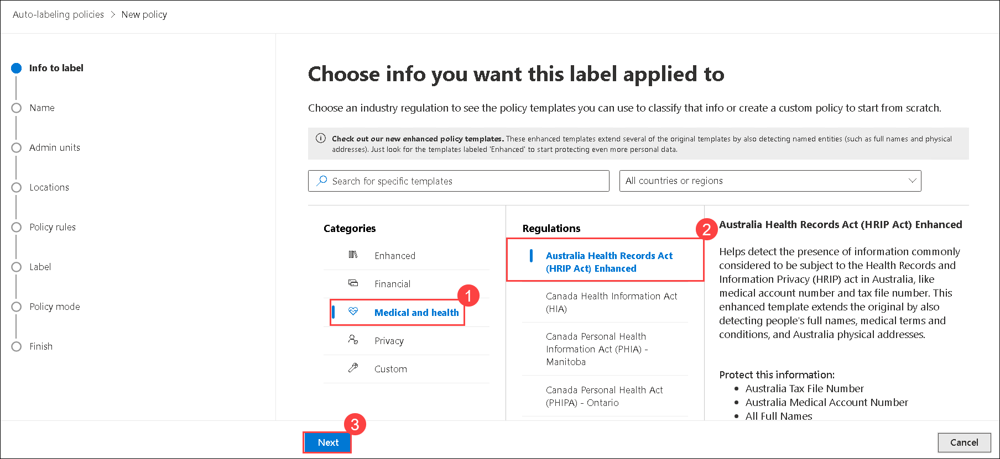

1. You can name your auto-label policy or use the default name **(1)**. Select **Next (2)**.

      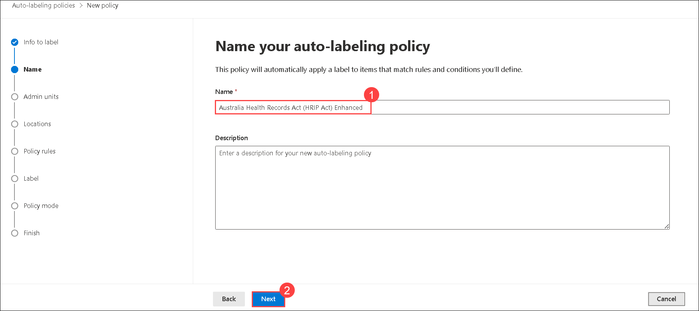

1. You can assign the admin units to which this policy applies. Leave the default set to full directory and select **Next**.      

      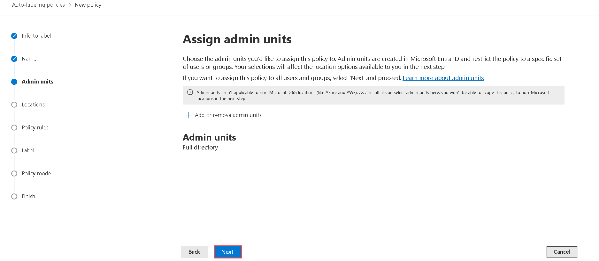   

1. Note the available **locations where you want to apply the label**. Leave the defaults and select **Next**.    

      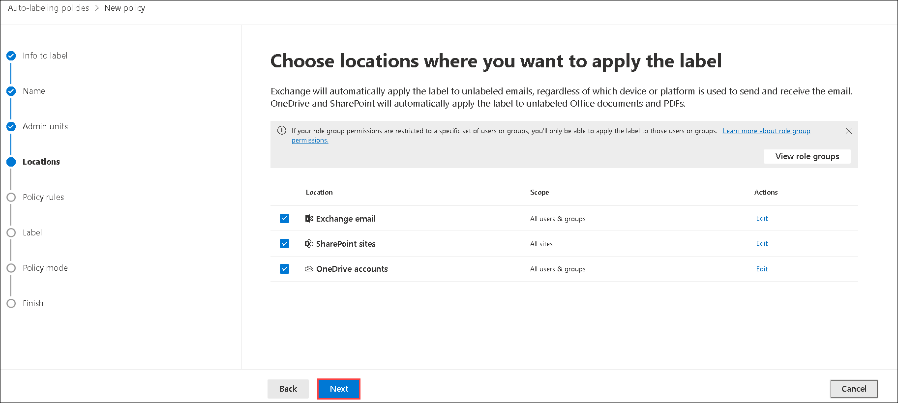   

1. You can **Set up common or advanced rules** that define what the content the label is applied to. Leave the default set to Common rules and select **Next**.

      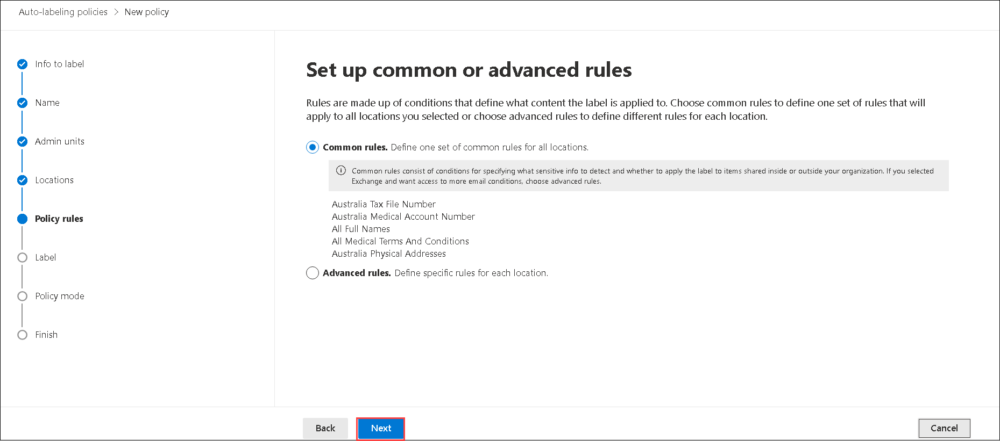   

1. You can **Define rules for content in all locations**. Leave all the default settings and select **Next**.     

      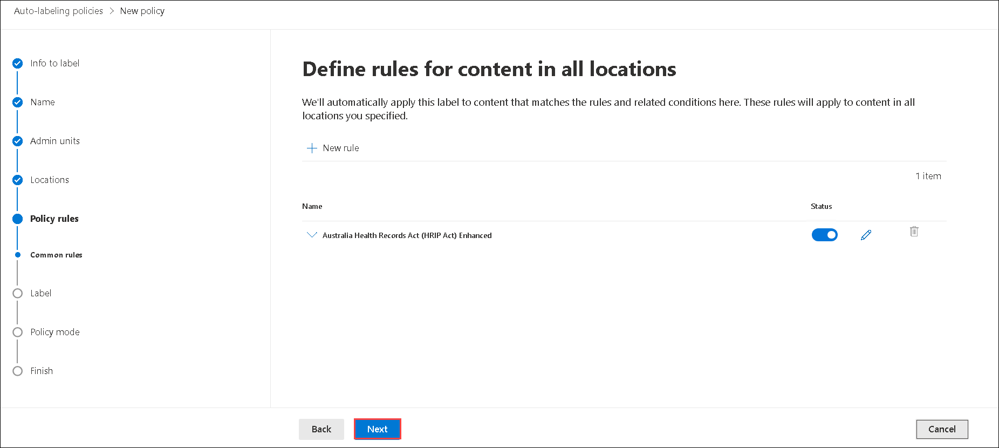   

1. Choose a label to auto-apply by selecting **+Choose a label (1)**. Choose a label **(2)** then select **Add (3)**. Select **Next (4)**.

      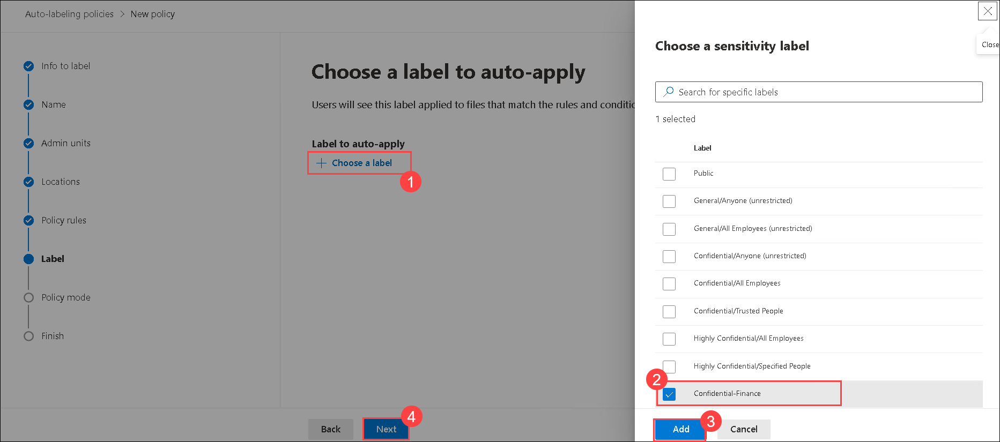   

1. **Additional settings can be configured for email**. Leave the defaults and select **Next**.      

      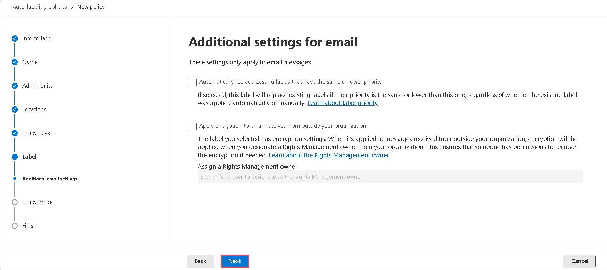   

1. You can decide to test the policy now or later. Select **Leave policy turned off (1)** then select **Next (2)**.

      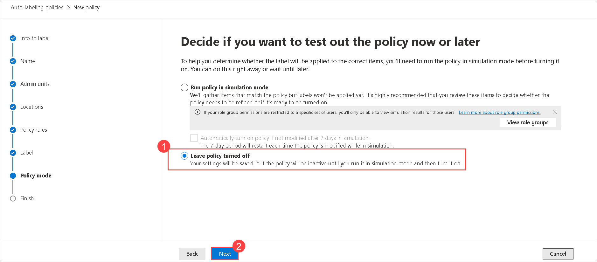   

1. Review the settings and select **Create policy** then select **Done**.      

      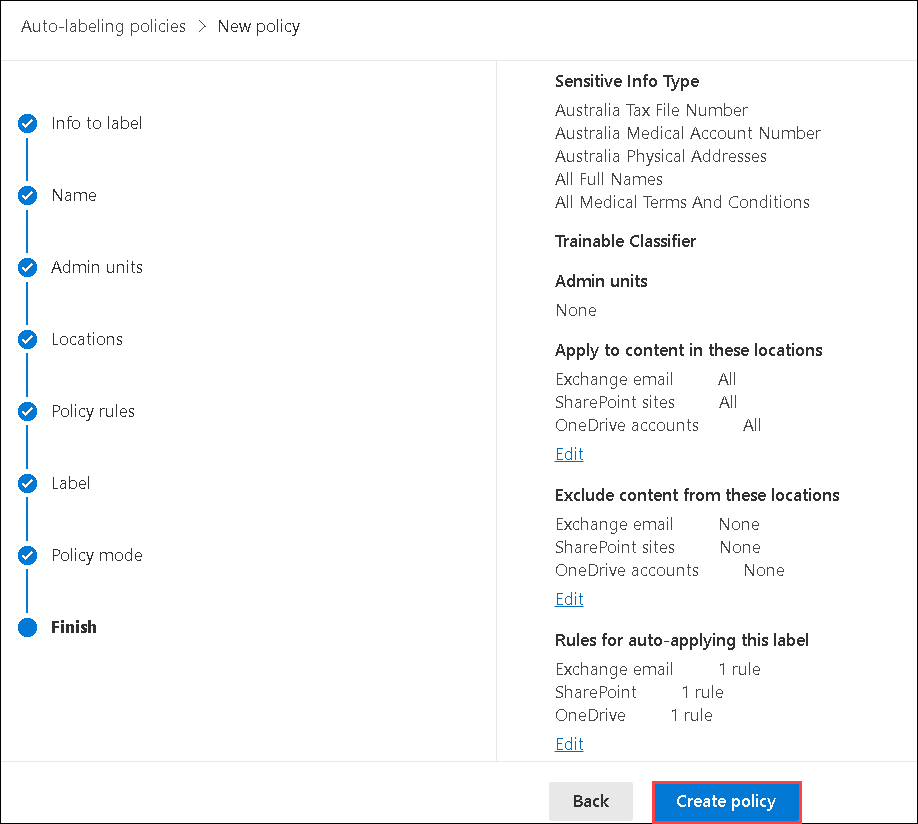   

      >**Note:** If you encounter any client error, please sign out, then sign back in, and then resume the process starting from step 43.

      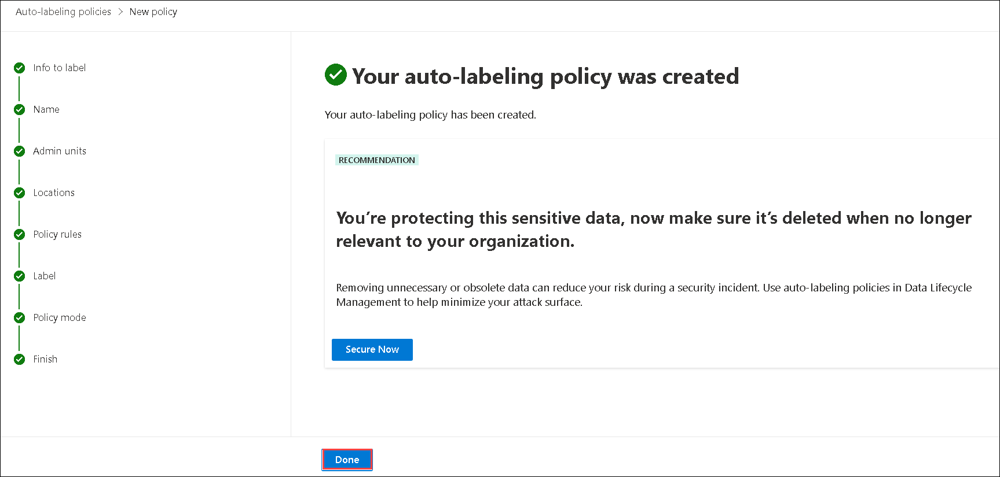   

1. From the left navigation panel, select **Home** to return to the Microsoft Purview portal.            

## Task 2: How to apply a label
In this task, you will go through the process of applying a label from the perspective of the user (in this case the user is the admin) and view the content marking that is generated by the label.

1. From the Microsoft Purview home page, select the **app launcher icon**, and **right click on the Word icon** and select **Open in new tab**. 

    

1. Select **+ New blank document**, then enter some text on the page.  On the blue bar on the top of the page, select the down-arrow, next to where it says DocumentXX - Saved, and in the File Name box enter, **Test-label**.

    

1. From the top menu bar, select **Sensitivity (1)**. From the drop down select **Confidential-Finance (2)** (**Note:** If the option is not available, it will take sometime to reflect, and if selecting the label shows error label cannot be added to Word on web, please try refreshing the page once or sign-out and sign-in again).

        

1. From the top menu bar, select **View**, then select **Reading view**.

                

1. Notice how the document includes the watermark. 

     

1. Close the Microsoft Word tabs that are open on your browser to exit from Word.

## Task 3 (optional): Impact of that label
In addition to content marking, the label protection setting was set for encryption. Per the permissions that were configured with this label, members of the finance group can co-author documents with this label applied and users in the Contoso tenant can view (or any document/email with the label applied).  In this task you will send this document to an email address to which you have access (ie., a personal email address) and that is NOT part of the .OnMicrosoft.com domain and see what happens when you try to open the attachment.  

1. From the Microsoft Purview home page, select the **app launcher icon**, and **right click on the Outlook icon** and select **Open in new tab**.

    

1. Select **New mail** from the top left corner of the screen.  

    

1. Enter an email address to which you have access **(1)** and is not part of the .OnMicrosoft.com domain and enter **Test (2)** in the subject line. Click on **Attach file (3)** drop down then select **Onedrive (4)**.

         

1. Select the word document you recently created to which you applied the label **Test-label (1)**. Select **Share link (2)**.

   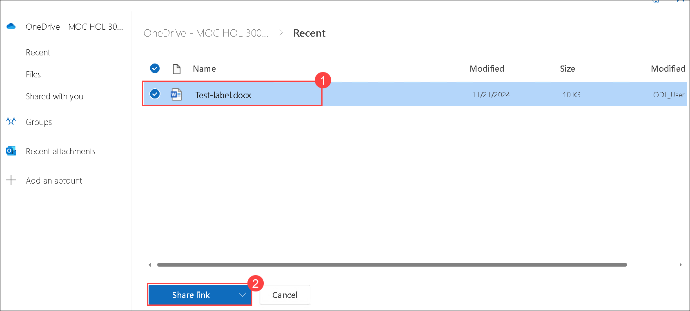 

1. Then click on **Send**.  

   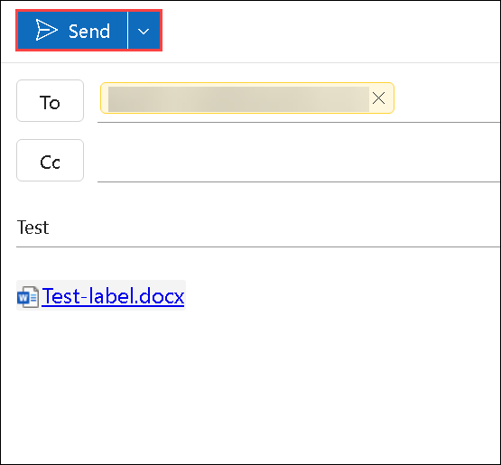 

1. Check the email to which you sent the document.  Note, the email may be directed to your junk folder.  When you attempt to open the attached word file you will see a notification that you do not have permission to open the document.

1. Close the open browser tabs.
   
## Review
In this lab, you have completed:
- Explore the capabilities of sensitivity labels
- How to apply a label
- Impact of that label

## You have successfully completed the lab

