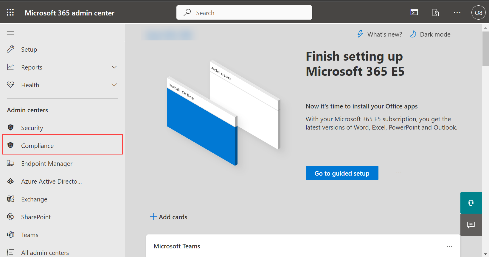
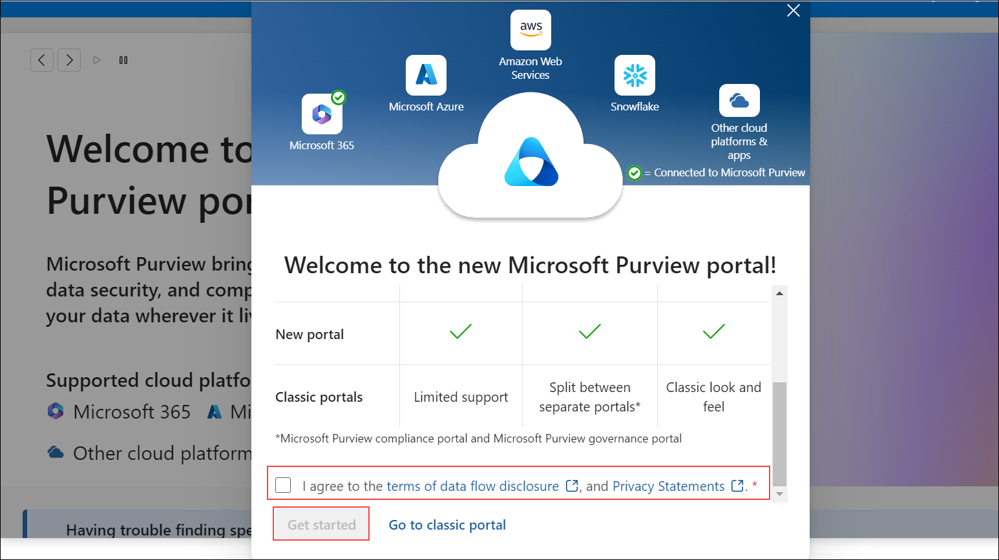
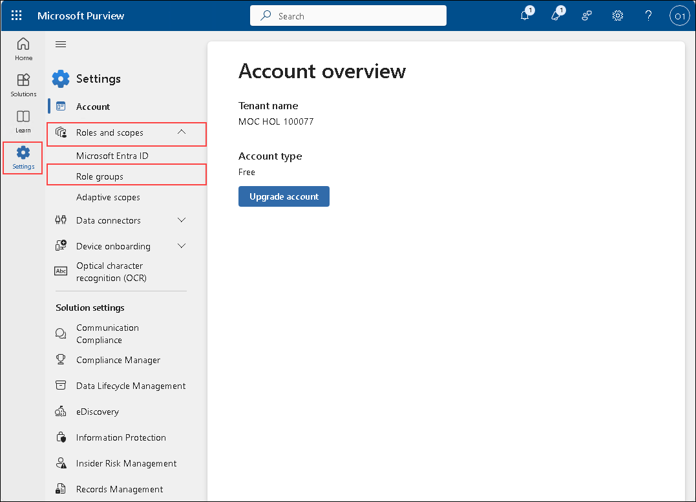
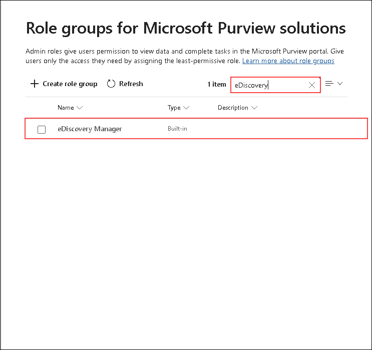
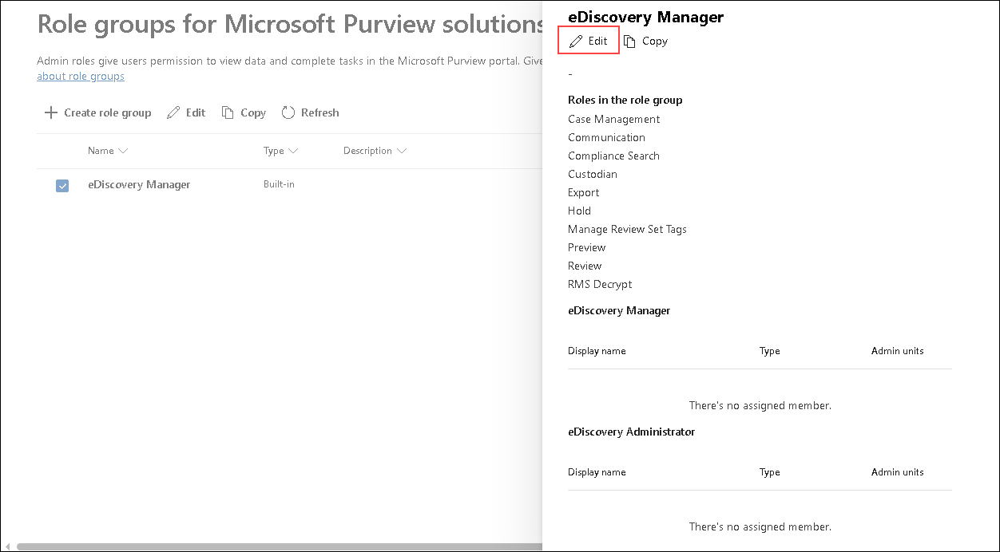
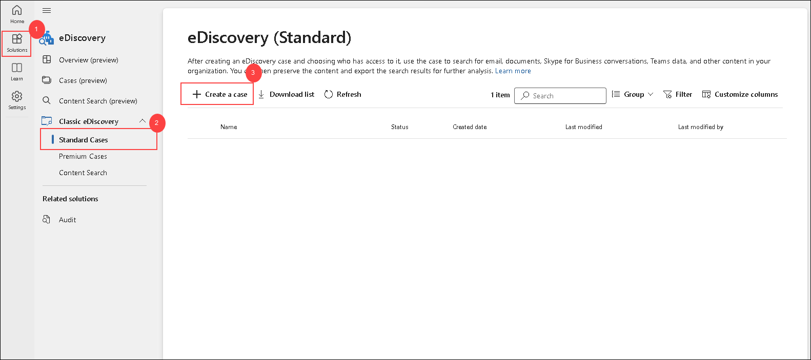

# Lab-15: Explore the Core eDiscovery workflow

## Lab scenario
In this lab you will go through the steps required for setting up Core eDiscovery and then go through the Core eDiscovery workflow, by creating an eDiscovery hold, creating a search query, and then exporting the results of the search.  Note:  Licensing for Core eDiscovery requires the appropriate organization subscription and per-user licensing. If you aren’t sure which licenses support core eDiscovery, visit Get started with Core eDiscovery.

## Lab objectives

In this lab, you will complete the following tasks:

+ Task 1: Add specific users as members of the eDiscovery Manager role group
+ Task 2: Create a case to start using Core eDiscovery
+ Task 3: Create an eDiscovery hold
+ Task 4: Create a search query

## Estimated timing: 60 minutes

## Architecture diagram

## Task 1: Add specific users as members of the eDiscovery Manager role group
To access Core eDiscovery or be added as a member of a Core eDiscovery case, a user must be assigned the appropriate permissions. In this task, you as the global admin, will add specific users as members of the eDiscovery Manager role group.

1. If you not already login to admin center, in the address bar of Microsoft edge enter **[admin.microsoft.com](https://admin.microsoft.com)**.

1. On **Sign in** blade, you will see a login screen, in that enter the following email/username 
 
    * Email/Username: **<inject key="AzureAdUserEmail"></inject>** and then click on **Next**.

    * Password: **<inject key="AzureAdUserPassword"></inject>** and then click on **signin**

1. From the left navigation pane of the Microsoft 365 admin center, select **Show all**.

    

1. Under Admin centers, select **Compliance**.  A new browser page opens to the welcome page of the Microsoft Purview portal.  

    

1. A new browser page opens to the **"Welcome page of the Microsoft Purview portal!"**, click on **"I agree to the terms of data flow disclosure and Privacy Statements"** and select **"Get started"**.

    

1. From the left navigation panel, select **Settings**, expand **Roles & scopes** then select **Role groups**.

    

1. In the search field, on the top, right of the page, enter **eDiscovery** then hit Enter on your keyboard.  Select **eDiscovery Manager**.

    
    
1. In the window that opens, notice how there are two sub-groups, eDiscovery Manager and eDiscovery Administrator. For this lab, we will add members to the eDiscovery Administrator sub-group.

1. Select **Edit** 

    

1. On **eDiscovery Manager** page select **Next** on  **Manager eDiscovery Manager**.

   

1. On **Manage ediscovery Administrator**, click on **Choose User (1)** and select **ODL_User **<inject key="DeploymentId"></inject>** and Megan Bowen (2)** from the list and click on **Select (3)** and **Next**.

   

1. On **Review and finish** page, select **Save**.

   

1. On **You successfully updated the role group** window, click **Done**.

     

1. Close all the tabs except the **[admin.microsoft.com](https://admin.microsoft.com)** and then **sign out** from the admin center page and **sign-in** back again to reflect the permissions added for users faster.

1. Keep this browser tab open, as you'll use it in the next task.

## Task 2: Create a case to start using Core eDiscovery
In this task you, as an eDiscovery Administrator (ODL admin is an eDiscovery administrator), will create a case to start using eDiscovery (Standard).

1. You should still be on the compliance portal roles page. If you closed the browser tab from the previous task, open a new browser tab and enter **https://compliance.microsoft.com** to get to the Microsoft Purview portal.

1. From the left navigation panel, under Solutions, expand **eDiscovery** then select **Standard Cases** click on **+ Create a case**.

      
   
1. In the New case window, enter a Case name, **SC900 Test Case** then select the **Save** at the bottom of the page.

    

1. The case should now appear on the list.

    

1. As the creator of the case and because you have eDiscovery Administrator privileges, you can begin to work with it.  

1. Keep this browser tab open, as you will use it in the subsequent task.

## Task 3: Create an eDiscovery hold
Now that you have created a Core eDiscovery case, you can begin to work with the case.  In this task, you will create an eDiscovery hold for the case for you just created.  Specifically, you will crate a hold for the exchange mailbox belonging to ODL-User.

1. Open the eDiscovery (Standard) tab on your browser.

1. From the Core eDiscovery page, select the case you created in the previous tab, **SC900 Test Case**. 

1. From the Home page of the case, select the **Hold** tab then select **+ Create**.

    

1. In the name field, enter **Test hold** then select **Next**.

    

1. In the Choose locations page, select toggle switch next to Exchange mailboxes to set the status to **On**, select **Choose users, groups, or teams** and select the **ODL-User-<inject key="DeploymentID" enableCopy="false" />** user and click on **Done**, select **Next**, for expediency with the lab, no other locations will be included in this hold.
    
    

    .png)

    1.png)
    
1. The Query conditions page enables you to create a hold, based on specific Keywords or Conditions that are satisfied, select **Select a filter** to view the available options.Select **Next**. Without any conditions, the hold will preserve all content in the specified location.

    
    
1. Review your settings and select **Submit**, it may take a minute, then select **Done**.  The Test hold should appear on the list.  If you don't immediately see it, select **Refresh**

    

1. Keep this browser tab open, as you will use it in the subsequent task.

## Task 4: Create a search query
With a hold in place, you will create a search query.  Once your search is complete you will go export and download the results for future investigation.   

1. Open the SC900 Test case tab on your browser.

1. From the Holds page of the case, select **Searches** > **+ New Search**.

    

1. In the Name field, enter **Test Hold – Sales Search**, then select **Next** from the bottom of the page.

    

1. In the Choose locations page, select toggle switch next to Exchange mailbox to set the status to **On**, select **Choose users, groups, or teams (1)** and select the **ODL-User-<inject key="DeploymentID" enableCopy="false" /> (2)** user and click on **Done (3)**, select **Next**.  

    

    

    .png)

1. The Query conditions page enables you to create a search, based on specific Keywords or Conditions that are satisfied, In the keyword field enter **Sales** select **Next**.

    

1. Review your settings and select **Submit**, it may take a minute, then select **Done**.  The search should appear on the list.  If you don't immediately see it, select **Refresh**

    
    
     

1. From the Searches window, select the search you just created, **Test Hold - Sales Search**.  A window that opens with the Summary tab selected.  Once the search is complete the status will indciate that the search is completed.  You will see a Search statistics tab (if you don't see the Search statistics tab, the search may still be running and may take a few minutes to complete). 

    

1. From the bottom of the page, select **Actions**.  Note the available options that include export options (the export options cannot be selected from within the lab platform provided by the authorized lab hoster, but are available in a production environment and are considered part of the standard workflow). Select **Close**.

      

1. Sign out and close all open browser windows. 

## Review
In this lab, you have completed:
- Added specific users as members of the eDiscovery Manager role group
- Created a case to start using Core eDiscovery
- Created an eDiscovery hold
- Created a search query
  
## You have successfully completed the lab
